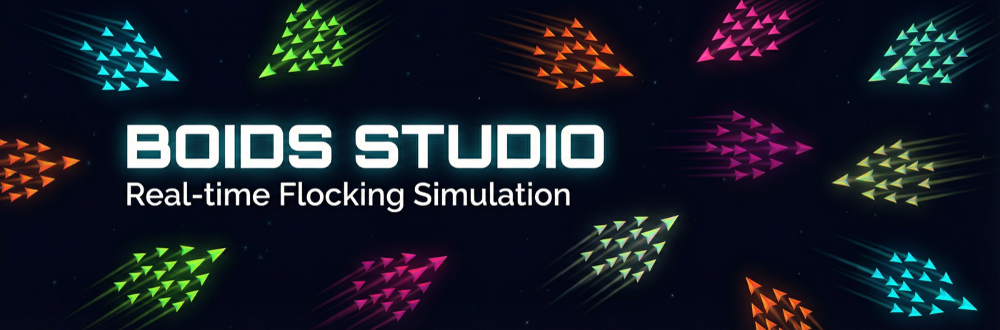
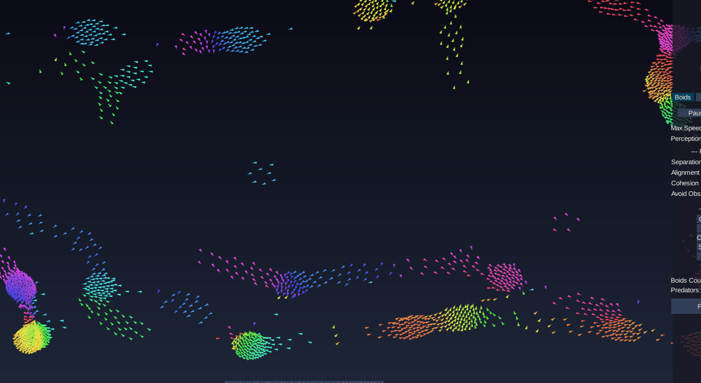
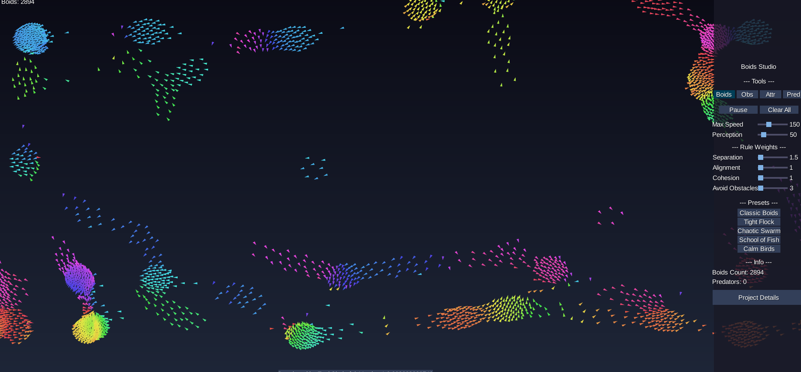
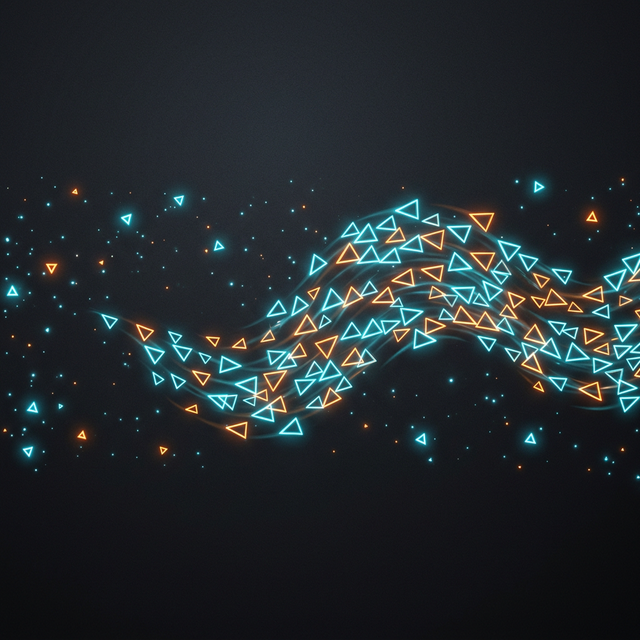

<div align="center">
  
</div>

<div align="center">


[](https://eyalshahaf.github.io/boids-studio/)


</div>

An interactive, real-time **flocking simulation** built with **Java 21** and **LibGDX** — running both natively on desktop and directly in the browser via GWT. Boids Studio goes beyond the classic three-rule algorithm with predator-prey dynamics, obstacle avoidance, food attractors, and a fully live-editable parameter set, all while sustaining **2,800+ boids at a steady 60 FPS in-browser**.

---

<div align="center">
  
  <sub>2,894 boids · 60 FPS · Chrome (GWT/WebGL)</sub>
</div>

---

## 📌 Project Status

> **Verified: 2,800+ boids at 60 FPS in the browser** 🚀

| Milestone | Status |
|---|---|
| Core physics & simulation (Vec2, Boid, spatial grid) | ✅ Complete |
| Desktop & web builds (LWJGL3 + GWT) | ✅ Complete |
| Interactive UI — sliders, tools, presets, HUD | ✅ Complete |
| Visual polish — HSL color, additive blending, motion trails | ✅ Complete |
| CI/CD pipeline — GitHub Actions → GitHub Pages auto-deploy | ✅ Complete |
| Automated versioning — build-timestamped releases | ✅ Complete |
| Three-phase performance overhaul | ✅ Complete |

---

## ✨ Features

### 🧠 Core Simulation

- **Classic Boids** — Separation, Alignment, and Cohesion implemented as a single-pass, allocation-free hot loop
- **Obstacle Avoidance** — Boids actively steer away from placed circular obstacles
- **Predator–Prey Dynamics** — Predators actively chase the nearest boid cluster; boids flee when a predator enters their perception radius
- **Food Attractors** — Place attractor points that boids are drawn toward, creating emergent feeding behavior
- **Edge Wrapping** — The world is toroidal; boids seamlessly cross any edge and reappear on the opposite side
- **Spatial Grid Acceleration** — An adaptive spatial hash grid ensures near-O(1) neighbor lookup, making large swarms feasible in real-time

### 🎨 Visual Rendering

- **Dynamic HSL coloring** — Each boid's hue is derived from its heading angle, producing naturally shifting color gradients across the flock
- **Additive blending** — Overlapping boids brighten rather than occlude, giving dense clusters a vibrant glow effect
- **Motion trails** — A fading trail follows each boid, reinforcing the sense of speed and fluid motion
- **Adaptive LOD** — Trail length, trail density, and boid triangle size all scale down automatically as the population grows to maintain framerate

### 🌐 Cross-Platform

- **Desktop** — Native LWJGL3/OpenGL build with uncapped FPS
- **Browser** — Full GWT compilation to JavaScript; no plugins, no download required

---

## 🎛 Live Controls

All parameters are adjustable in real-time via the collapsible right-side panel.

<div align="center">
  
  <sub>The control panel — collapsible, fully live</sub>
</div>

### 🛠 Placement Tools

Select a tool from the toolbar, then **left-click or drag** anywhere on the simulation canvas:

| Tool | Action |
|---|---|
| **Boids** | Spawn boids at the cursor position. Hold and drag to paint a stream of boids. |
| **Obs** (Obstacles) | Place a solid circular obstacle (radius 30). Boids will actively steer around it. Right-click to remove. |
| **Attr** (Attractors) | Place a food attractor. Nearby boids are drawn toward it, forming feeding clusters. |
| **Pred** (Predators) | Place a predator that chases the nearest boid cluster at 1.5× boid speed. Boids within perception range will flee. |

### ⚙️ Simulation Parameters

| Slider | Range | Effect |
|---|---|---|
| **Max Speed** | 10 – 400 | Top velocity of every boid. Higher values produce more energetic, fast-moving swarms. |
| **Perception** | 10 – 300 | Radius within which each boid perceives its neighbors. Larger values create broader, slower flocks. |
| **Separation** | 0 – 50 | Repulsion strength between boids. High values prevent crowding and break up tight groups. |
| **Alignment** | 0 – 50 | How strongly boids match the direction of their neighbors. High values produce coordinated streams. |
| **Cohesion** | 0 – 50 | Attraction toward the local group center. High values pull boids into dense formations. |
| **Avoid Obstacles** | 0 – 100 | Obstacle repulsion multiplier. Higher values widen the avoidance margin around obstacles. |

### 🎬 Preset Configurations

One-click presets that instantly reconfigure all parameters for a specific emergent behavior:

| Preset | Behavior |
|---|---|
| **Classic Boids** | Balanced default parameters — natural, free-form flocking as described by Craig Reynolds |
| **Tight Flock** | Elevated cohesion and alignment; boids snap into dense, fast-moving formations (180 px/s) |
| **Chaotic Swarm** | High separation, minimal alignment, high speed; produces erratic, turbulent swarm motion (250 px/s) |
| **School of Fish** | Strong alignment with a wide perception radius; smooth, coordinated stream behavior |
| **Calm Birds** | Slow, loosely distributed movement with a large perception horizon — meditative and gentle (80 px/s) |

### ▶ Simulation Controls

| Button | Action |
|---|---|
| **Pause / Resume** | Freeze or resume the simulation at any time |
| **Clear All** | Remove all boids, obstacles, attractors, and predators from the world |

---

## 🎮 Mouse & Keyboard Reference

| Input | Action |
|---|---|
| Left Click / Drag | Use the currently selected placement tool |
| Right Click | Remove the nearest obstacle |
| Scroll Wheel | Zoom in / out (range: 0.1× – 5×) |
| `<` button (panel edge) | Collapse the control panel |
| `>` button (screen edge) | Expand the control panel |

---

## 🧮 What Are Boids?

Boids is an artificial-life simulation model created by Craig Reynolds in 1986 to reproduce emergent flocking behavior. Each agent follows only three local rules — yet from these rules, complex coordinated swarm dynamics arise spontaneously.

**The three rules:**

1. **Separation** — Steer away from boids that are too close, preventing collisions
2. **Alignment** — Gradually match the heading and speed of nearby boids
3. **Cohesion** — Steer toward the average position of the local neighborhood

**Boids Studio extends this foundation with:**

- Obstacle repulsion fields
- Predator pursuit and prey-fleeing instincts
- Food attractor gravity
- Fully tunable weight parameters — alter any rule weight at runtime to explore the phase space of emergent behavior

---

## 🏗 Architecture

The project is a multi-module Gradle build:

```
core/      Shared simulation + UI logic (platform-independent Java)
           ├── model/    Vec2, Boid, Obstacle, Attractor, Predator
           ├── sim/      World, BoidRules, SpatialGrid
           ├── config/   SimulationConfig, Preset
           ├── render/   WorldRenderer, BoidRenderer, TrailRenderer
           ├── input/    InputHandler
           └── ui/       ControlPanel, StatsOverlay, SkinFactory

lwjgl3/    Desktop launcher — LWJGL3/OpenGL, native window

html/      Web launcher — GWT compilation to JavaScript
```

**Design principles:**
- Simulation logic is fully decoupled from rendering and platform code
- Zero external dependencies beyond LibGDX itself
- All hot paths are allocation-free — no per-frame heap objects on the critical loop
- Configurable and extensible: all tunable constants live in `SimulationConfig`

---

## 🚀 Running the Project

### Prerequisites

- Java 21 (or latest LTS)
- Gradle (or use the included `./gradlew` wrapper — no installation needed)

### ▶ Run Desktop

```bash
./gradlew :lwjgl3:run
```

### 🌐 Build & Serve Web

```bash
# Compile GWT and package the dist folder
./gradlew :html:dist

# Serve locally with any static server
npx serve html/build/dist
```

### 🔧 GWT Superdev (hot-reload web development)

```bash
./gradlew :html:superDev
# Then open http://localhost:8080 in your browser
```

---

## 🧪 Testing

Unit and integration tests cover the core simulation logic:

- **Vec2** — arithmetic correctness, magnitude, normalization, edge cases
- **World** — boid lifecycle, obstacle and predator interactions, edge wrapping stability, NaN/explosion guards

**Testing framework:** JUnit 5

```bash
./gradlew test
```

---

## ⚡ Performance Optimizations

Three focused optimization passes were required to push beyond the ~600-boid browser ceiling and reach **2,800+ boids at 60 FPS**.

### Phase 1 — Simulation lifecycle

| Optimization | Impact |
|---|---|
| **Spatial grid reuse** — `SpatialGrid` is cleared and reused each frame; recreated only when perception radius or world size changes | Eliminates full `HashMap` re-allocation every frame |
| **Perception radius caching** — `perceptionRadius` and `perceptionRadius²` computed once per `World.update`, threaded through all rule calls | Removes redundant sqrt calls at the top of each rule |
| **UI throttling** — `ControlPanel` and `StatsOverlay` label updates capped at ~8 Hz | Eliminates ~52 string allocations per second per label |

### Phase 2 — Hot-loop allocation elimination

| Optimization | Impact |
|---|---|
| **Single-pass flock rule** — `BoidRules.flock()` combines Separation, Alignment, and Cohesion in one neighbor loop | Cuts loop overhead by 3× |
| **Raw float accumulation** — inner loop uses `float` math; produces exactly one `Vec2` per boid per frame | Eliminates ~80,000 short-lived allocations/frame at 1,000 boids × 20 neighbors |
| **No-sqrt separation** — `diff * 500/d²` replaces `diff.normalize().scale(500/d)` | Removes one `Math.sqrt` call per in-range neighbor |
| **Neighbor buffer reuse** — single pre-allocated `ArrayList<Boid>` cleared before each spatial query | Eliminates 1,000+ `ArrayList` allocations per frame |
| **Predator proxy** — single pre-allocated proxy boid replaces per-predator-per-frame `new Boid(...)` | Eliminates predator-count object allocations per frame |
| **Index-based iteration** — all hot-path list traversals use index loops | Avoids `Iterator` allocation on every traversal |

### Phase 3 — Adaptive rendering

| Optimization | Impact |
|---|---|
| **Adaptive trail quality** — trail length reduces at 600+ boids, shortens again at 1,000+, disables entirely at 1,500+ | Largest single rendering win at high counts |
| **Trail decimation** — at 1,000+ boids, every other trail segment is skipped | Halves line draw calls at high density |
| **Trail ring buffer** — `LinkedList<Vec2>` replaced with `ArrayDeque<Vec2>` | Better cache locality, zero per-node allocation |
| **LOD boid rendering** — triangle size scales: 6px → 4px at 1,000 boids → 3px at 1,500 | Reduces fragment fill rate at high population |

### Benchmark results

| FPS Target | Boid Count |
|---|---|
| **60 FPS** (adaptive trails) | ~1,500 – 2,800 |
| **60 FPS** (trails disabled) | 2,000 – 2,800+ |
| **30+ FPS** | 2,800 – 4,000+ |

> Verified: **2,894 boids at a sustained 60 FPS** in Chrome on standard consumer hardware.

---

## 🤖 Built With AI

This project was developed with the assistance of AI tools (Cursor / Claude) as a learning and exploration exercise in emergent systems, game-dev architecture, and browser performance optimization.

---

## 📚 Why This Project?

Boids Studio was built as:
- A deep dive into emergent behavior simulation
- A clean architecture exercise in Java game development
- An exploration of browser performance limits with GWT/WebGL
- A browser-deployable interactive experiment that anyone can run instantly

---

## 📜 License

MIT — see [LICENSE](LICENSE)

---

## 👤 Author

**Eyal Shahaf** — [GitHub](https://github.com/EyalShahaf/boids-studio)

---

<div align="center">
  
</div>
